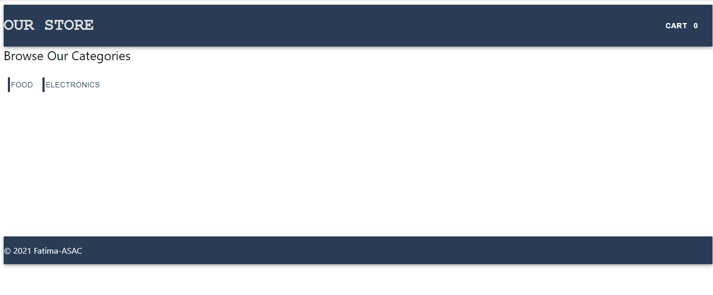

# Store Front - Virtual Store

## Author: Fatima Atieh

## Overview

An online shopping portal for a fictional store. Our application will power an online storefront that will allow our users to browse our product offerings by category, place items in their shopping cart, and check-out when they are ready to make their purchase.

### Requirements

The core requirements and functionality are as follows:

- Display a list of our product categories
- Display a listing of products for each category, when the category is selected
- From the product listings:
   - Click to view a full detail page about the product
   - Add the product to your shopping cart
- Shopping cart (simple version) always visible on screen
- Full shopping cart and check out screen available from main navigation

### Technical Requirements

The application was created with the following overall architecture and methodologies

- React
- ES6 Classes
- Redux Store for Application State
- Deployed API with Mongo storage for storing categories and products
- Superagent for performing API Requests
- Material UI for layout and styling
- Test Driven Development, using Jest
- Deployment to a cloud provider (Netlify, Amplify, or GitHub Pages)

## Setup

`npx create-react-app app-name` to create your React app

`npm run start` to run your app

This is the API used to get the products and categories: `https://api-js401.herokuapp.com/api/v1`
   - To get products : `https://api-js401.herokuapp.com/api/v1/products`
   - To get categories: `https://api-js401.herokuapp.com/api/v1/categories`

### Dependencies  

`npm i` the dependencies in the image below

## Test

This is the flow of the app

### 1. This is the main page

You can see the two categories of products that the store have: Food and Electronics 

### 2. You can choose one of the categories availabe 

*In the example here I chose the FOOD category*

### 3. If you clicked on `View Details' you will be directed to the product's details page

*In the example here I chose Apples*

You can view the image, price of the product and how many items available 

### 4. You can add your favorite product to the `Cart` by clicking on `ADD TO CART`

*In the example here I added Apples to cart*

### 5. You can also delete products from CART

*In the example here I added Apples and Calzones to cart and deleted Calzones*

### 6. This is the Order page, by clicking on the product in the CART this is the form you will see

